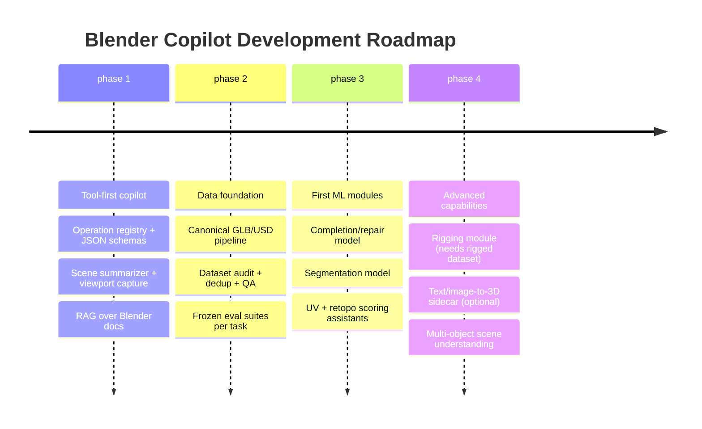

# Deep Research Report: Building a Blender Copilot for 3D Modeling, Interaction, and Helper AI

## Executive summary

A practical “Blender copilot” is best treated as a **tool-using, multimodal agent** that (a) interprets user intent from text + viewport/UI context, (b) calls deterministic geometry operations in the host DCC, and (c) selectively invokes learned 3D models for the few tasks where classical geometry processing is brittle or too slow when done manually. The most reliable near-term path is to use **Qwen 2.5 VL as the interaction/reasoning layer** plus a **3D tool/runtime layer** inside Blender (Python add-on) and an optional external “geometry service” for heavy compute. This mirrors what large 3D systems in the literature do: scale data and model size where it matters, but keep production operations grounded in a robust pipeline and evaluation harness. citeturn2search0turn5view0turn7view0turn4view0

Your projected dataset size (~129,000 primitives/shapes/meshes) is **credible for**: (1) geometry-processing supervision/self-supervision (repair, completion, segmentation, certain transform/edit tasks), (2) learning-based “assist modules” that refine or propose operations, and (3) CAD/primitive-sequence learning if the data is truly parametric. It is **not** comparable to what recent “foundation-ish” 3D generators rely on for broad open-world generalization (often **hundreds of thousands to millions+** shapes or rendered multi-view images). For example: Objaverse 1.0 is **800K+** 3D models citeturn24search1turn24search9; Objaverse-XL is **10M+** objects and is explicitly reported to yield improvements from scale (e.g., for Zero123-XL). citeturn3search22turn3search18turn3search8

Three empirical “scaling signals” that matter for your planning:
- **Data scale improves generalization** in large 3D vision/generation pipelines: Objaverse-XL reports “improvement with scale” and uses >100M multi-view renders to train large conditional models. citeturn3search22turn3search8turn3search14  
- **Instruction / grounding datasets show measurable scaling effects**: 3D-GRAND explicitly reports a “scaling effect between dataset size and 3D-LLM performance,” with performance improving as data scales up. citeturn4view0  
- **Task-specific large curated datasets unlock robustness**: Anymate introduces a **230K** rigged-asset dataset (70× larger than prior public rigging datasets) and reports that larger training data significantly improves predictions and that certain architectures “scale well with the larger dataset.” citeturn9view0turn20view3  

Finally, general neural scaling-law work (outside 3D) suggests a predictable pattern: for a fixed dataset size, scaling the model improves test error until it saturates at a dataset-determined limit. That is a strong prior that your 129k dataset will cap performance for highly expressive generative tasks unless you (a) add more data, (b) add strong priors/representations, or (c) shift more capability into deterministic tool execution. citeturn3search28

Prioritized action items (what to do first, with the highest ROI):
- Build a **tool-first Blender add-on** with safe execution (undo/redo discipline, dry-run previews, diffs), and make Qwen call structured “ops” rather than emitting raw Python. citeturn2search6turn2search8  
- Define a **single canonical asset format + metadata schema** (recommend: GLB for object assets; USD for scenes/shot-like assets), plus a reproducible preprocessing + QA pipeline. citeturn15search0turn15search1turn15search6turn15search2turn5view0  
- Run a **dataset audit** to quantify diversity/quality and to compute “effective dataset size” (deduplication + coverage) before training anything. Use Objaverse-XL’s filtering/dedup mindset as your reference standard. citeturn3search22turn5view0turn24search8  
- Establish an evaluation harness with **frozen test suites** for each capability (completion, repair, UV, retopo, rigging, segmentation) and build baselines using classical methods (Instant Meshes/QuadriFlow, ABF/LSCM, etc.). citeturn8search1turn8search0turn10search25turn8search2turn6search1  
- Only then start ML: train **small, measurable modules** (completion/repair; segmentation; rigging if you have rigged data), and produce scaling curves (10%, 30%, 60%, 100% of data). citeturn4view0turn6search1turn9view0  

## System architecture for a Blender copilot

A modern copilot architecture should separate: **interaction intelligence** (language/vision reasoning) from **geometry authority** (Blender scene state + deterministic ops) and from **learned 3D priors** (models trained on meshes/point clouds/CAD programs). This separation is strongly supported by how large 3D datasets and models are used in the literature: large models are trained on standardized representations (e.g., GLB normalized to unit cube; multi-view rendering; captions), while the execution environment remains a conventional renderer/DCC. citeturn5view0turn4view0turn7view0

Recommended high-level decomposition:

- **Interaction & Orchestration Layer (Qwen 2.5 VL)**  
  Use Qwen primarily to: (1) parse natural language, (2) interpret viewport screenshots and UI state, and (3) select tools + parameters. Recent Qwen-VL family design goals include vision-language understanding, localization, and “agentic” usage patterns. citeturn2search0turn2search1  

- **Blender Runtime Layer (Add-on)**  
  A Python add-on should implement:
  - An **operation registry** (a constrained set of validated modeling functions, each with a JSON schema).  
  - “Safe apply”: snapshot/undo integration, object selection scoping, and parameter clamping.  
  - A “scene summarizer” that exports a compact scene graph (object names, types, transforms, materials, polycounts, UV presence, rigs, etc.) and optionally a viewport render/ID pass for grounding.  
  Blender scripting and operator usage is stable and well documented in official manuals and APIs. citeturn2search6turn10search25turn15search6  

- **Geometry/ML Service Layer (Optional external process)**  
  Offload heavy operations (SDF conversion, multi-view rendering farms, diffusion inference, large point sampling, repair networks) to a separate process to avoid freezing Blender’s UI. This matches common practice in 3D pipelines where compute-heavy steps are batched. citeturn5view0turn7view0  

Mermaid sketch of a robust tool-using copilot (interaction → planning → execution):

```mermaid
flowchart TD
  U[User: text + screenshots + selection] --> L[Qwen 2.5 VL: intent + plan + tool calls]
  L -->|JSON tool call| R[Tool Router / Policy]
  R --> B[Blender Add-on Runtime\n(op registry + safety + undo + diffs)]
  B --> S[Scene State + Geometry Nodes + Operators]
  R --> G[Geometry/ML Service\n(Open3D + custom models)]
  G --> B
  B --> V[Viewport updates + previews]
  V --> U
  R --> K[Knowledge/RAG\n(API docs, local playbooks)]
  K --> L
```

Key reliability principle: **Qwen should not be the geometry source of truth**. It should propose actions; Blender should validate, execute, and report diffs. This is especially important because 3D operations are highly stateful and small parameter mistakes can cause destructive changes.

Entity note (org referenced once): entity["organization","Blender Foundation","open-source 3d org"] maintains Blender.

## Data strategy: dataset size, scaling signals, composition, and diversity metrics

### Dataset size recommendations and what “129k” really means

Your ~129k shapes can be “large” or “small” depending on: (a) task, (b) representation, (c) annotation density, and (d) shape diversity. A few empirical anchors from widely used benchmarks and recent large-scale datasets:

- **Shape completion / completion-like tasks** often work in the tens of thousands of shapes per benchmark split: PoinTr’s ShapeNet-55 benchmark reports ~41,952 training shapes and 10,518 test shapes derived from ShapeNet categories. citeturn6search1  
- **Large open-world 3D object corpora** are now at the 800K–10M+ regime: Objaverse 1.0 has 800K+ models; Objaverse-XL has 10M+. citeturn24search1turn3search22turn24search5  
- **Rigging** is a clear example where bigger datasets are now viewed as necessary: Anymate collects 230K rigged assets and frames this as a step-change over prior datasets; the paper also reports scale-driven improvements. citeturn9view0turn20view3  
- **Text-to-3D** research frequently mentions “several million” 3D assets (paired with text or rendered views) for strong breadth: Shap-E reports being trained on “a dataset of several million 3D assets.” citeturn16search13  
- **CAD sequence datasets** are commonly in the 8K–178K range for human-authored sequences: Fusion 360 Gallery provides 8,625 human design sequences; DeepCAD reports 178,238 CAD models with construction sequences. citeturn14search2turn14search1turn24search32  
- **CAD geometry corpora** can be extremely large if you use B-Rep repositories: ABC dataset is introduced as **one million CAD models**. citeturn24search4turn24search8turn24search20  

These anchors imply:
- If your 129k are **high-quality curated meshes with consistent conventions**, you can likely support strong results for **repair/completion/segmentation** and for “assistant modules” that propose or validate operations. citeturn6search1turn12search1turn8search3  
- If your 129k are mostly **simple primitives** or narrow in category/topology, they are unlikely to yield broad, high-fidelity “open-world” generation. Large-scale datasets explicitly emphasize diversity and deduplication because raw count is not enough. citeturn3search22turn24search9turn5view0  

### Empirical scaling signals and practical “scaling laws” you can use

3D has fewer clean, universal scaling-law papers than LLMs, but you can still plan rigorously using a combination of (1) reported 3D scaling effects and (2) general scaling-law expectations:

- **General scaling-law expectation (broad ML)**: test error often decreases with model scale until it saturates at a dataset-size-dependent floor. This implies you should expect diminishing returns from model scaling if you keep 129k fixed, especially for complex generative tasks. citeturn3search28  
- **3D-text grounding scales with dataset size**: 3D-GRAND reports that performance improves consistently as data scales up, and explicitly shows scaling analysis plots tying data size to grounding and hallucination reduction. citeturn4view0  
- **3D dataset scaling improves generalization for conditional generation / view synthesis**: Objaverse-XL reports improvements enabled by scaling, and Zero123-XL is documented as trained on 10M+ 3D objects. citeturn3search22turn3search18turn3search8  
- **Production-scale 3D generative pipelines invest heavily in standardization/cleaning**: 3DTopia-XL filters and standardizes meshes (GLB assumed; unit cube normalization; filtering subcomponents), retaining 256k objects from Objaverse for training. This is a tangible example of “quality and procedural standardization” mattering as much as raw count. citeturn5view0  
- **Rigging strongly benefits from scale**: Anymate positions 230K assets as “crucial for training robust learning-based models” and reports better scaling behavior for larger architectures with more data. citeturn9view0turn20view3  

A practical “scaling plan” you can implement (and publish internally) is:
- Fix model family + training budget per run.
- Train on dataset fractions: **1k / 5k / 20k / 60k / 129k** (or logarithmic steps).
- Record task metrics (per task section below).
- Fit a simple power-law or log-linear curve per metric to estimate the **data regime where you’re still data-limited vs. model-limited**.

This is exactly the kind of scaling analysis that 3D-GRAND demonstrates for grounding performance vs data size, which you can mirror for your geometry tasks. citeturn4view0

### Dataset composition: what to include and how to measure diversity

A Blender copilot that is useful beyond “toy tasks” needs coverage across:

- **Object categories & semantics** (chairs, vehicles, tools, characters, props, environments)  
- **Topology & structure** (manifold/watertight vs open; genus; thin structures; disconnected components)  
- **Resolution regimes** (low-poly, mid, high; presence of LODs)  
- **Appearance** (materials, textures, UV layouts, PBR parameters)  
- **Animation/rigging** (armatures, skin weights, keyframes)  
- **Procedural parameters** (geometry nodes graphs, CAD operation sequences, constraints)

Public datasets illustrate the breadth you may need:
- ShapeNetCore provides ~51,300 clean aligned models across 55 categories. citeturn24search2turn24search6  
- Thingi10K was built specifically because “in-the-wild” meshes contain artifacts (self-intersections, non-manifoldness) not captured by “too clean” academic toy models—this is directly relevant to repair tooling. citeturn11search3  
- ABO provides ~7,900 product models with 4K PBR textures in glTF 2.0, which is valuable for material/texture tasks. citeturn13search0turn13search4  
- OmniObject3D (6,000 scanned objects) and Google Scanned Objects (1,030 scanned objects) provide realistic scanned geometry + appearance distributions that stress reconstruction pipelines. citeturn13search10turn13search1  
- Anymate (230K) demonstrates the scale needed for diverse rigging/skin weights. citeturn9view0turn20view3  

Concrete diversity/coverage metrics (actionable, compute-friendly):
- **Category entropy / long-tail index**: Shannon entropy over labels; Gini coefficient of counts; “top-k share.” (Requires labels; if absent, derive pseudo-labels via taxonomy or CLIP-on-renders as weak labels, then audit.) citeturn24search6turn24search11  
- **Topology/validity rates**: % manifold, % watertight, % self-intersections (approx), # components distribution; boundary edge ratio. Thingi10K explicitly motivates capturing such mesh pathologies for real-world relevance. citeturn11search3  
- **Resolution & geometric complexity distributions**: vertices/faces; edge length histograms; curvature histograms; triangle quality. (ABC dataset and geometry-processing literature emphasize ground truth differential quantities and feature detection—useful cues for what to store/measure.) citeturn24search4turn24search20  
- **Appearance richness**: number of materials per asset; texture resolution; UV island count; UV stretch/overlap estimates; PBR channel completeness (baseColor/metallic/roughness/normal). glTF 2.0 and Blender’s glTF exporter documentation give a concrete checklist of what “complete” PBR looks like. citeturn15search0turn15search6turn15search5  
- **Rig/animation statistics**: bone count distribution; skinning sparsity; keyframe counts; presence of morph targets. Anymate shows typical preprocessing (resampling points and interpolating skin weights) and filtering by vertex/bone count thresholds. citeturn20view3turn9view0  

image_group{"layout":"carousel","aspect_ratio":"16:9","query":["non-manifold mesh example","quad retopology example Instant Meshes QuadriFlow","UV unwrapping texture atlas distortion example","rigged character mesh skeleton skin weights visualization"],"num_per_query":1}

### Table: high-value dataset sources to mix (and why)

| Dataset / Source | Scale (order of magnitude) | Primary modality | Includes PBR/UV | Includes semantics | Includes rigging/anim | Best used for |
|---|---:|---|---|---|---|---|
| Objaverse 1.0 | 800K+ objects citeturn24search1turn24search9 | Mixed 3D assets | Mixed/variable | Captions/tags; some anim citeturn24search1turn24search9 | Some anim mentioned citeturn24search1 | Broad pretraining; retrieval; synthetic renders |
| Objaverse-XL | 10M+ objects citeturn3search22turn24search13 | Mixed 3D assets | Mixed/variable | Scale + diversity; deduplicated citeturn3search22turn24search17 | Some armatures exist (see rigging mining) citeturn20view3 | Scaling-law regime; robust generalization |
| ShapeNetCore | ~51,300 models, 55 cats citeturn24search2turn24search6 | Clean CAD meshes | Variable | Category + alignment verified citeturn24search6 | No | Completion/segmentation baselines; canonical splits |
| ABC Dataset | 1,000,000 CAD models citeturn24search4turn24search8 | CAD B-Rep/meshes | No (focus on geometry) | Supports features/differential GT citeturn24search4 | No | Geometry learning, feature detection, reconstruction, CAD-like priors |
| DeepCAD | 178,238 CAD sequences citeturn14search1turn24search32 | CAD command sequences | No | Implicit via ops | No | Parametric modeling agent; procedural reconstruction |
| Fusion 360 Gallery | 8,625 sequences citeturn14search2turn14search11 | Human CAD sequences | No | Operation-level labels exist in related releases citeturn14search14 | Assemblies/joints metadata in repo citeturn14search4 | Learning “human-like” CAD edits; program synthesis style tasks |
| Thingi10K | 10,000 printable meshes citeturn11search3turn11search11 | Real-world messy meshes | Variable | Tags/classes/quality analysis citeturn11search3 | No | Repair/cleanup realism; robustness testing |
| ABO | ~7,900 3D models (PBR) citeturn13search0turn13search4 | Product meshes | Yes (4K textures, PBR) citeturn13search0 | Product metadata citeturn13search4 | No | Materials/texture transfer; real-world assets |
| Google Scanned Objects | 1,030 scans citeturn13search1turn13search5 | Scans | Yes (textured) | Metadata/categories citeturn13search1 | No | Reconstruction sanity checks; sim2real stress |
| OmniObject3D | ~6,000 scans, 190 cats citeturn13search10turn13search14 | High-quality scans | Yes | Rich annotations + multi-view data citeturn13search10 | No | Realistic perception/reconstruction/generation tracks |

Organization note (referenced once): Objaverse is hosted by entity["organization","Allen Institute for AI","ai research institute"]. citeturn24search5turn24search25

## Annotation schemas and synthetic data generation

### A unified annotation schema to support all target tasks

You will move faster if you standardize on a schema that supports:
- object-level metadata,
- geometry-level annotations,
- appearance-level annotations,
- rig/animation metadata,
- and “paired supervision” links for transform/edit tasks.

Recommended “asset record” (conceptual; implement in JSON + Parquet):
- **Identity & provenance**: asset_id, source/license, hash (geometry + textures), author/vendor, import tool versions. (For licensing, Objaverse and Cap3D emphasize Creative Commons / filtering; you need similar tracking.) citeturn24search9turn24search31  
- **Geometry**: canonical mesh path(s), normalized transform, units, watertight/manifold flags, component graph, vertex/face counts, curvature stats.  
- **Semantics**: category label (if known), part hierarchy (optional), text caption(s), tags. Cap3D shows a scalable way to generate captions and yields hundreds of thousands of 3D-text pairs on Objaverse. citeturn24search11turn24search15turn24search31  
- **Materials/UV**: PBR channels present, texture resolutions, UV islands, distortion metrics, UDIM usage, shader nodes summary. glTF PBR and Blender’s glTF documentation provide a concrete canonical set of channels. citeturn15search5turn15search6  
- **Rigging/animation**: armature present, bone hierarchy, bone counts, skin weights stats, animation clips. Anymate demonstrates how to extract mesh + bones + weights and resample points for training. citeturn20view3turn9view0  
- **Paired-task links**:  
  - repair: (corrupted_mesh_id → clean_mesh_id),  
  - retopo: (hires → quad/lowpoly),  
  - UV: (mesh → authored UV),  
  - texture transfer: (mesh A ↔ mesh B correspondences), etc.

### Synthetic data generation and augmentation strategies that actually work

Synthetic generation is not optional if you want coverage across failure modes, especially for repair, UV, and retopology. The literature shows common patterns:

- **Completion/repair supervision via simulated partial observations**: Many completion benchmarks generate incomplete point clouds by sampling viewpoints and removing points. PoinTr details this benchmark design and provides a train/test split on ShapeNet categories. citeturn6search1  
- **Caption synthesis**: 3DTopia-XL generates captions for a subset of Objaverse renders using GPT-4V-like systems (keywords → sentence) as a scalable approach to text supervision. citeturn5view0  
- **Rigging augmentation**: Anymate uses additional animation keyframes (up to a few per asset) to augment training data, and unifies formats across inconsistent artist exports. citeturn9view0turn20view3  
- **Mesh standardization and filtering**: 3DTopia-XL describes filtering fragmented meshes and inconsistent UVs, then normalizing to the unit cube. This is the template you should emulate for a stable pipeline. citeturn5view0  

Concrete augmentation recipes (organized by task):
- **Repair / cleanup**: introduce non-manifold edges, decimate + re-triangulate, punch holes, add self-intersections/near-intersections, noise perturbations, texture coordinate corruption; target output is the original clean mesh. Thingi10K motivates why these artifacts are common in real assets. citeturn11search3  
- **Retopology**: generate pseudo-ground-truth by running Instant Meshes / QuadriFlow and treating the output as a supervision target; then build a second tier of “human-preferred” retopo examples later. Instant field-aligned meshing and QuadriFlow are standard baselines for quad-dominant remeshing and reduced singularities. citeturn8search0turn8search1  
- **UV unwrapping**: use Blender ABF/LSCM as baseline unwraps and xatlas as an external unwrap/packing baseline; then supervise a model to imitate “artist UV” or to optimize seam style. Blender manual documents ABF and LSCM options; xatlas documents automatic UV generation. citeturn10search25turn10search1  
- **Materials/texture**: domain randomize PBR parameters within glTF’s metallic-roughness model; use high-quality PBR datasets (ABO) as anchors. citeturn13search0turn15search8  
- **Instruction/edit data**: synthesize paired “before/after” states by applying random but valid modeling operations and generating natural language descriptions (templated + LLM paraphrase). 3D-GRAND shows large-scale instruction tuning benefits when language is densely grounded to objects. citeturn4view0  

## Model architectures and training regimes that integrate well with Qwen 2.5 VL

### A practical model family map for your copilot

You should treat “3D modeling AI” as a **portfolio** of models/algorithms, not one model.

#### Tool-execution first (recommended baseline)
- Qwen classifies intent and produces structured tool calls (select object, apply modifier, unwrap UV, remesh, export GLB, etc.).  
- Geometry results come from Blender operators/Geometry Nodes and known geometry-processing libraries.

This is the most stable for interactive workflows because it avoids asking a generative model to hallucinate exact topology.

#### Learned shape priors for hard tasks
Pick representations aligned to each task:

- **Point/implicit-field completion & repair**: Transformer-based completion (PoinTr) is a strong reference design and uses tens-of-thousands-scale training sets. citeturn6search1  
- **High-fidelity generation (diffusion / latent 3D)**: 3DTopia-XL illustrates a production-style approach: convert GLB meshes to a structured latent primitive representation (PrimX), VAE-compress patches, then a transformer diffusion model at ~1B parameters; they emphasize data standardization and show inference times (seconds on A100). citeturn5view0  
- **Fast reconstruction models (interactive)**: TripoSR reports single-image mesh reconstruction in under ~0.5s on an A100-class GPU, illustrating the feasibility of near-interactive 3D generation modules when compute exists. citeturn16search2turn16search23  
- **CAD / procedural modeling**: DeepCAD and Fusion 360 Gallery provide sequence-based CAD representations and dataset sizes that are close to your 129k regime, if your dataset really is parametric. citeturn14search1turn14search2turn14search11  
- **Rigging/animation**: Anymate provides both a dataset (230K) and baseline module decomposition: joint prediction → connectivity → skinning weights, with explicit Blender extraction steps. citeturn9view0turn20view4  
- **Language↔mesh unification (optional)**: LLaMA-Mesh demonstrates that a language model can be fine-tuned to emit meshes as text (OBJ format), creating conversational mesh generation/understanding—useful as a research direction but typically risky as a production geometry generator due to format constraints and context-length limits. citeturn21view0turn22view0  

Company notes (each referenced once):
- entity["company","NVIDIA","gpu manufacturer"] is central in several 3D scaling and mesh/LLM works. citeturn3search15turn3search7turn21view0  
- entity["company","OpenAI","ai research company"] released Shap-E (trained on several million 3D assets) and earlier Point-E. citeturn16search13turn16search5turn16search0  

### Fine-tuning vs. retrieval-augmented generation for the copilot

A workable division of labor:

- **RAG (recommended for most “how do I do X in Blender?”)**  
  Index: Blender operator docs, internal playbooks, your own add-on API, and small recipes. This keeps the system up-to-date without fine-tuning and aligns with the reality that DCC workflows change. Blender’s manuals for glTF, USD, UV operators, etc., are ideal RAG sources. citeturn15search6turn15search2turn10search25  

- **Fine-tuning / LoRA (use sparingly for structured outputs)**  
  Fine-tune only where you need:
  1) consistent JSON tool-call formatting,  
  2) consistent refactoring/explanation style for modeling scripts,  
  3) instruction-to-operation mapping that your users do frequently.

3D-GRAND uses LoRA fine-tuning on an LLM backbone and reports strong gains from instruction tuning with a large grounded dataset. This is evidence that adapter-style tuning can be viable for 3D grounding tasks. citeturn4view0  

- **Specialized model training (for geometry, not language)**  
  Train dedicated models for completion/repair/segmentation/rigging if you have proper supervision pairs and an evaluation harness (below).

### Table: model families mapped to tasks and constraints

| Model family | Best-fit tasks | Data requirement signal | Latency profile | Integration notes |
|---|---|---|---|---|
| Deterministic geometry ops (Blender + classical geometry processing) | retopo baseline, UV unwrap baseline, decimation/remesh, many edits | Doesn’t “scale with data” (scales with engineering) | Interactive | Use as baselines and as “safe fallbacks” citeturn8search1turn10search25 |
| Point/mesh completion transformers | completion, repair, denoise | Tens of thousands (e.g., ShapeNet-55 split sizes) citeturn6search1 | Usually sub-second to seconds | Good for “fix my scan / fill holes” modules |
| Latent diffusion on 3D-native representations | text/image-to-3D, high-fidelity asset gen | Hundreds of thousands+ curated (example: 256k filtered Objaverse subset) citeturn5view0 | Seconds on high-end GPU | Treat as external service; cache results |
| Large reconstruction models (LRMs) + self-training | single-image reconstruction at scale | Scaling data is key; Real3D frames scaling as the main bottleneck and motivation citeturn7view0 | Can be fast (TripoSR ~0.5s on A100) citeturn16search23turn16search2 | Best for “import from reference image” workflows |
| CAD sequence transformers | parametric modeling, procedural inference | 8k–178k sequences in public datasets citeturn14search2turn14search1 | Fast once trained | Only worth it if you have true procedural traces |
| Rigging pipelines (multi-module) | skeleton + skinning prediction | 230k rigged assets in Anymate; scale matters citeturn9view0turn20view3 | Seconds | Strong candidate for a “character helper” mode |
| LLM-as-mesh (OBJ text) | conversational mesh generation/description | Needs mesh-text pairs; constrained by context length; uses Objaverse meshes citeturn21view0turn22view0 | Token-length bound | Research-y; consider only for constrained primitives/low-face meshes |

## Data pipeline, storage, and preprocessing

### Canonical formats and why

For a Blender copilot, your dataset has to preserve not just geometry, but also appearance and (optionally) animation:

- **glTF/GLB for single objects**:  
  glTF 2.0 supports skinned animation and morph targets and defines storage for animation keyframes; it is also the de facto container for PBR materials in many pipelines. citeturn15search0turn15search6turn15search5  
- **USD for scenes and multi-asset composition**:  
  OpenUSD is framed as a robust/scalable interchange framework for complex scenes composed from many assets; Blender supports importing/exporting subsets of USD. citeturn15search1turn15search2turn15search25  

Standards notes (each referenced once):
- entity["organization","Khronos Group","graphics standards consortium"] maintains glTF. citeturn15search0turn15search12  
- entity["company","Pixar Animation Studios","animation studio"] originated USD; OpenUSD docs emphasize interchange of complex scenes. citeturn15search1turn15search25  

### Mesh cleaning, normalization, and canonicalization—what to standardize

A consistent preprocessing pipeline is not optional; 3DTopia-XL describes the failure modes you should expect at scale (fragmented meshes, non-watertight shapes, inconsistent UVs) and implements a standardized loading/filtering/normalization procedure (connected component filtering + unit cube normalization). citeturn5view0  

A robust pipeline for your dataset should include:

- **Import normalization**  
  - unify coordinate system conventions (right/left-handed), units, and scale;  
  - center and scale to unit cube or unit sphere (store transform for inversion).  
  This mirrors practices described in 3DTopia-XL and many ShapeNet-based benchmarks. citeturn5view0turn6search1  

- **Geometry validity checks**  
  - degenerates (zero-area triangles), duplicate vertices, inverted normals;  
  - manifoldness / boundary edges / self-intersection heuristics;  
  - connected components (remove tiny floaters). 3DTopia-XL explicitly filters small subcomponents and low-quality meshes. citeturn5view0  

- **Canonicalization options** (use cautiously)  
  - PCA alignment can help but may destroy semantic orientation; ShapeNet provides verified alignments specifically to avoid this ambiguity. citeturn24search6turn24search2  

- **Derived representations for training**  
  - point clouds (uniform surface samples),  
  - SDF / occupancy samples,  
  - multi-view renders + depth + masks,  
  - graph structures (adjacency, edge features),  
  depending on the model family.

Cap3D’s released artifacts (captions + point clouds + renders) show a mature pattern for creating paired multimodal training data at scale. citeturn24search7turn24search31  

### Storage layout and data versioning

A proven approach is “immutable raw + versioned derived”:

- `raw/` : original downloads/imports (don’t edit)  
- `canonical/vX/` : cleaned GLB/USD + canonical transforms  
- `derived/vX/` : point clouds, SDF samples, renders, embeddings  
- `meta/vX/` : Parquet tables (one row per asset, plus per-material/per-part tables)  
- `splits/vX/` : task-specific train/val/test splits (frozen once you publish metrics)

This is the same conceptual pattern used by large datasets that release both “core assets” and derived annotations/benchmarks.

## Evaluation metrics, benchmark tasks, and a suggested test suite

### Core tasks and metrics (aligned to your requirements)

**Reconstruction / Completion / Repair**
- **Chamfer Distance (CD)** and variants; PoinTr uses CD and defines large ShapeNet-based benchmarks with explicit train/test sizes. citeturn6search1  
- **Normal consistency**, **F-score** on distance thresholds (commonly paired with point/mesh evaluation; also used in multiple 3D reconstruction works). citeturn5view0turn6search1  
- **Watertightness / manifoldness pass rate** (repair-specific), motivated by Thingi10K’s emphasis on real-world mesh pathologies. citeturn11search3  

**Editing / Transform operations**
- Define “intended edit” tasks (e.g., “make it hollow,” “add bevel,” “reduce polycount to N,” “mirror along X,” “fix UV overlap”) and evaluate:
  - geometric deltas localized to intended region,  
  - preservation of non-target regions,  
  - topology constraints (no self-intersections, consistent normals).

**Retopology**
- Baseline algorithms: Instant Meshes and QuadriFlow; QuadriFlow explicitly targets fewer singularities in quad meshes, important for downstream parametrization/subdivision. citeturn8search0turn8search1  
- Metrics:
  - singularity count / irregular valence rate,  
  - quadness ratio,  
  - edge flow alignment to principal curvature directions (approx),  
  - distortion under subdivision (optional).

**UV unwrapping / texture transfer**
- Blender provides ABF and LSCM unwrapping; these are standard baselines. citeturn10search25  
- Use parameterization distortion metrics:
  - **L2 stretch**, angle/area distortion; stretch-minimizing parameterization literature defines these metrics explicitly. citeturn10search2turn10search8  
- Seam metrics:
  - seam length, island count, overlap rate; Autocuts-like work explicitly balances seams and distortion. citeturn10search31  
- Benchmarking:
  - Use “artist UV” targets where available; “A Dataset and Benchmark for Mesh Parameterization” is explicitly designed around artist-provided UVs and multi-metric evaluation. citeturn18search0turn19view0  
- Stress cases:
  - AI-generated meshes are often noisy/bumpy; PartUV is motivated by these failure modes and proposes part-aligned charts with fewer fragments. citeturn18search2turn18search13  

**Rigging / Skinning**
- Use Anymate-style metrics:
  - joint prediction via Chamfer Distance + Precision/Recall under thresholds,  
  - connectivity prediction IoU,  
  - skinning weight Precision/Recall based on “influential bones” thresholding. citeturn20view4turn20view0turn20view3  

**Semantic segmentation**
- For parts: ShapeNetPart provides a large annotated benchmark; Yi et al. describe creating per-point labels for 31,963 models in 16 categories and is widely used for part segmentation evaluation. citeturn12search1turn12search2  
- For fine-grained parts: PartNet provides 26,671 models across 24 categories with hierarchical part instances. citeturn8search3turn8search15  
- Metrics: mean IoU (mIoU), part-wise IoU (PartNet paper reports segmentation comparisons using IoU). citeturn8search11turn12search1  

### Suggested test suite structure (what to freeze)

Create a “Copilot Eval Pack” with multiple tracks, each with a small “fast” set and a larger “full” set:

- **Fast sanity pack (≤200 assets)**: hand-curated to cover extremes: non-manifold, dense scan, thin structures, multi-material, UV overlaps, rigged character, etc. Thingi10K and 3DTopia-XL both highlight that robustness requires hard examples, not just clean averages. citeturn11search3turn5view0  
- **Full regression pack (2k–10k assets)**: stratified sampling by category, topology, resolution, and appearance complexity.  
- **Hold-out categories**: mimic ShapeNet-55 style generalization tests (train on subset categories; test on unseen). citeturn6search1  
- **Real-scan OOD pack**: use Google Scanned Objects / OmniObject3D subsets for reality gap. citeturn13search1turn13search10  

## Recommended experiments and a prioritized roadmap

### Experiments you should run early

**Scaling curves (data)**
- For each task module (completion, repair, segmentation, UV, retopo proxy scoring), train at multiple dataset sizes: 1k / 5k / 20k / 60k / 129k.  
- Track: CD/F-score (completion), validity rates (repair), mIoU (segmentation), stretch/seams (UV), singularities/quadness (retopo).  
- Fit curves and identify the “knee” where returns diminish; 3D-GRAND’s explicit scaling analysis is a close template. citeturn4view0turn6search1turn10search2  

**Ablations (representation + supervision)**
- Completion: point cloud vs mesh; partial-generation methods; input corruption patterns as in PoinTr benchmarks. citeturn6search1  
- UV: ABF vs LSCM vs xatlas baseline; evaluate on artist UV benchmark dataset where possible; compare to PartUV-style part priors once you have segmentation. citeturn10search25turn10search1turn18search2  
- Rigging: joint-only vs joint+connectivity vs full pipeline; use Anymate metrics. citeturn20view4turn20view2  
- “Copilot utility” ablation: tool-first vs model-first: measure user time-to-completion and error rates.

**System-level evaluation**
- End-to-end tasks in Blender: “take this mesh, make it game-ready” (retopo + UV + bake + export GLB). Use glTF export as the final measurable artifact (valid GLB; texture packing correctness; no missing channels). citeturn15search6turn15search0  

### Roadmap (prioritized, staged)



Interpretation in terms of your 129k dataset:
- Phases 1–2 can proceed almost independently of dataset scale; they are engineering + evaluation.  
- Phase 3 is where 129k can already yield strong results for completion/repair/segmentation if the dataset has diversity and quality. citeturn6search1turn12search1  
- Phase 4 (rigging, broad generation) likely requires either (a) targeted new data acquisition (e.g., mining rigged assets; Anymate-scale), or (b) integrating external pretrained models trained on much larger corpora. citeturn9view0turn3search22turn16search13  

### Table: recommended dataset sizes per task (actionable targets)

These are “unique assets” counts after deduplication and QA; paired datasets may require multiple derived samples per asset (renders, corruptions, etc.).

| Task | Minimum viable (prototype) | Strong (likely competitive) | Foundation-scale / broad generalization | Empirical anchors |
|---|---:|---:|---:|---|
| Mesh cleanup/repair (validity + small fixes) | 5k–20k | 50k–200k | 500k+ | Thingi10K motivates real-world artifacts; 3DTopia-XL filtering shows cleaning burden citeturn11search3turn5view0 |
| Completion (partial → full) | 10k | ~50k–150k | 500k+ | PoinTr trains on ~41,952 ShapeNet-55 models citeturn6search1 |
| Semantic segmentation (object parts) | 5k–20k labeled | 20k–50k labeled | 200k+ labeled/open-vocab | ShapeNetPart: 31,963 models (16 cats) citeturn12search1turn12search2; PartNet: 26,671 models (24 cats) citeturn8search3turn8search15 |
| Retopology (hi-res → quad/low) | 2k–10k paired | 20k–100k paired | 200k+ paired | Strong classical baselines exist (Instant Meshes/QuadriFlow) citeturn8search0turn8search1 |
| UV unwrapping (mesh → UV seams + packing) | 2k–10k artist UV targets | 20k–50k artist UV | 200k+ | Blender ABF/LSCM baselines; mesh parameterization benchmark exists; PartUV addresses AI-mesh failure modes citeturn10search25turn18search0turn18search2 |
| Texture/material transfer (PBR-ready assets) | 1k–5k PBR assets | 10k–50k PBR assets | 100k+ | ABO has ~7,900 PBR models citeturn13search0turn13search4; glTF defines PBR channels citeturn15search8 |
| Rigging + skinning | 5k–20k rigged | 100k–300k rigged | 500k+ | Anymate: 230k rigged assets; scale benefits reported citeturn9view0turn20view3 |
| CAD parametric modeling (sequence generation/edit) | 5k–20k sequences | 100k–200k sequences | 1M+ (if available) | Fusion 360 Gallery: 8,625; DeepCAD: 178,238; ABC: 1M CAD models citeturn14search2turn14search1turn24search4 |
| Open-world text-to-3D generation | 100k (narrow domain) | 500k–2M | 5M–10M+ | Shap-E trained on “several million” 3D assets citeturn16search13; Objaverse/Objaverse-XL scale regimes citeturn24search1turn3search22 |

### Suggested primary sources to consult (papers, datasets, toolkits)

Key datasets and scaling references:
- Objaverse 1.0 (800K+) and Objaverse-XL (10M+), plus “improvement with scale” claims. citeturn24search1turn3search22turn3search8  
- 3D-GRAND (scaling effect for 3D-LLM grounding + hallucination benchmark). citeturn4view0  
- 3DTopia-XL (representation + data standardization + 256k filtered training set example). citeturn5view0  
- Real3D (explicitly frames scaling as bottleneck/motivation for LRMs). citeturn7view0  
- Anymate (230K rigged dataset; explicit evaluation metrics and Blender extraction pipeline). citeturn9view0turn20view3  
- ShapeNetCore and ShapeNetPart lineage (clean baseline + part labels). citeturn24search6turn12search1turn12search2  
- ABC dataset (1M CAD models; geometry deep learning ground truth). citeturn24search4turn24search20  

Geometry processing baselines and UV metrics:
- Instant Field-Aligned Meshes and QuadriFlow (retopology baselines; singularities). citeturn8search0turn8search1  
- Blender UV operators (ABF/LSCM) and xatlas UV library. citeturn10search25turn10search1  
- Stretch/angle/area distortion metrics in parameterization literature, and seam/distortion optimization (Autocuts). citeturn10search2turn10search31turn10search8  
- Mesh parameterization dataset/benchmark framing (artist UV target evaluation). citeturn18search0turn19view0  

Interchange/tooling standards:
- glTF 2.0 spec + Blender glTF documentation (PBR channels; animation/skins). citeturn15search0turn15search6turn15search5  
- OpenUSD documentation + Blender USD manual (scene interchange). citeturn15search1turn15search2  

Companies referenced once for dataset/tool provenance:
- entity["company","Autodesk","cad software company"] (Fusion 360 Gallery ecosystem and B-Rep datasets). citeturn14search2turn14search14  
- entity["company","Amazon","ecommerce company"] (ABO PBR assets). citeturn13search0turn13search20  
- entity["company","Google","technology company"] (Google Scanned Objects; OmniObject3D ecosystem connections). citeturn13search1turn13search10turn13search13  
- entity["company","Stability AI","generative ai company"] (TripoSR speed target for interactive reconstruction). citeturn16search23turn16search2  
- entity["organization","LAION","open dataset org"] (Objaverse-XL announcement context). citeturn3search14